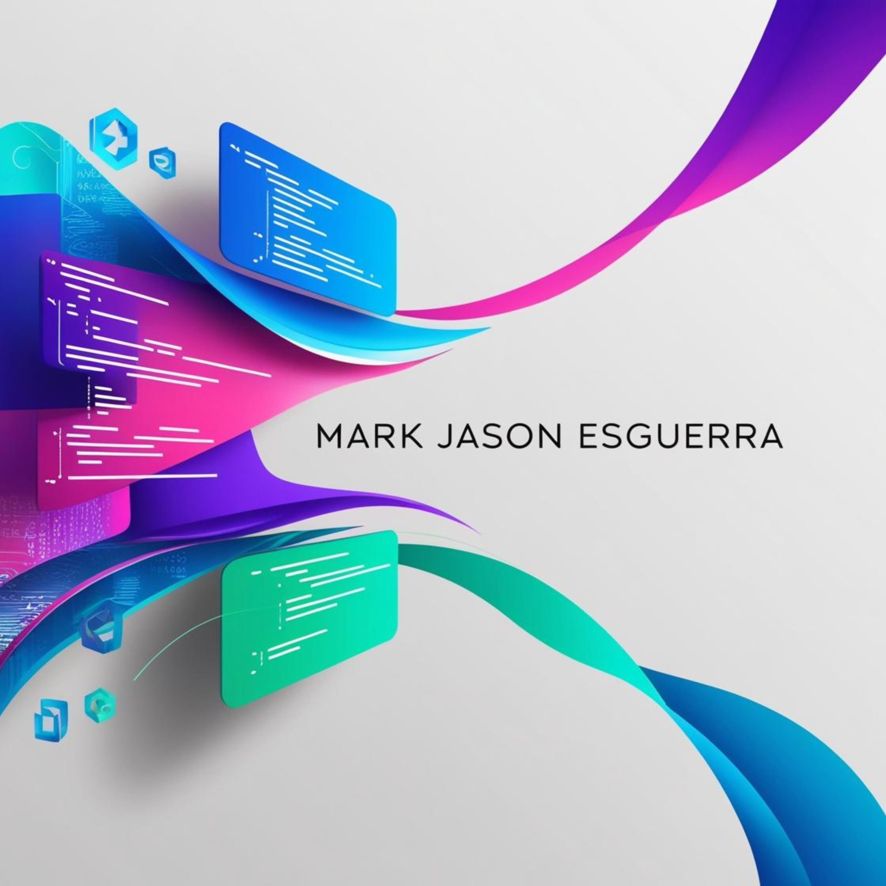

# Web Development Project

Welcome to my Web Development project! This project showcases my work and skills in creating dynamic, user-friendly websites and applications.

## Project Overview

This project is designed to demonstrate a full-stack web development process, using modern web technologies such as HTML, CSS, JavaScript, and more. Below is a glimpse of the project's cover design.

## Cover Image


## Features
- 

## Technologies Used
- 


## Installation

To install this project locally, follow these steps:

1. Clone the repository:
   ```bash
   git clone https://github.com/markjasonesguerra/webdev-project.git
