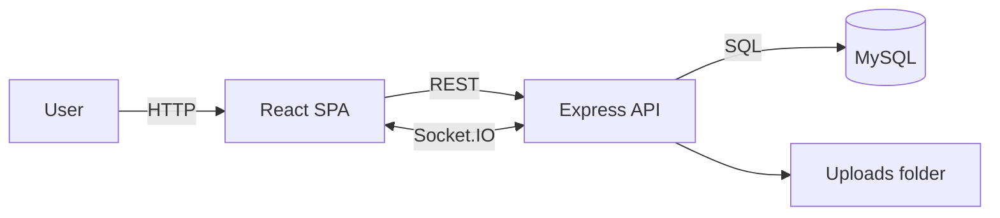

# Mark Cart Marketplace


Mark Cart is a full-stack marketplace application with a React customer storefront, an admin management area, and a Node/Express API backed by MySQL. It includes product and category management, cart and order flows, vouchers, reviews, and a real-time customer support chat.

## Table of Contents

- [Features](#features)
- [Tech Stack](#tech-stack)
- [Architecture](#architecture)
- [Project Structure](#project-structure)
- [Environment Variables](#environment-variables)
- [Getting Started](#getting-started)
- [Scripts](#scripts)
- [API Overview](#api-overview)
- [Admin Capabilities](#admin-capabilities)
- [Notes](#notes)

## Features

- Customer registration and login with JWT, password reset, and TOTP-based 2FA
- Google OAuth login with automatic customer creation
- Product catalog with categories, subcategories, search, filters, and sorting
- Product media uploads and category images (multer + local uploads directory)
- Cart, checkout, and order tracking with status and payment updates
- Voucher creation, validation, and usage limits
- Reviews with multi-metric ratings and auto-updated product averages
- Profile management with avatar upload and address book
- Real-time support chat with conversations, read receipts, and admin moderation
- Optional Electron shell to run the app in a desktop window

## Tech Stack

- Frontend: React 18, React Router, Axios, Socket.IO client
- Backend: Node.js, Express, Socket.IO, JWT, bcryptjs, multer
- Database: MySQL (mysql2 pool)
- Auth: JWT + TOTP (speakeasy) + QR codes (qrcode) + Google OAuth
- Email: Nodemailer (Gmail SMTP)
- Desktop: Electron (root package)

## Architecture



- The React SPA runs on port 3000 during development.
- The Express API runs on port 8800 by default and exposes REST routes under `/auth`, `/products`, `/cart`, `/orders`, `/reviews`, `/vouchers`, `/chat`, `/profile`.
- Socket.IO is used for real-time chat between customers and admins.
- Product and category images are stored under `backend/uploads`.

## Project Structure

```
.
├── backend/                # Express API
│   ├── index.js            # API entry point, Socket.IO setup
│   ├── routes/             # Auth, products, cart, orders, chat, reviews, vouchers
│   ├── middleware/         # Auth middleware
│   ├── utils/              # DB pool, email helper
│   └── uploads/            # Uploaded images
├── frontend/               # React SPA
│   ├── src/                # Pages, components, styles
│   └── build/              # Production build output
├── main.js                 # Electron launcher
└── package.json            # Electron dev dependency and script
```

## Environment Variables

Create a `.env` file inside `backend/`:

| Variable | Description |
| --- | --- |
| `DB_HOST` | MySQL host |
| `DB_USER` | MySQL user |
| `DB_PASS` | MySQL password |
| `DB_NAME` | MySQL database name |
| `DB_PORT` | MySQL port (defaults to 3306) |
| `JWT_SECRET` | JWT signing secret |
| `EMAIL_USER` | Gmail address for SMTP |
| `EMAIL_PASS` | Gmail app password |
| `CORS_ORIGIN` | Allowed frontend origin (defaults to `http://localhost:3000`) |
| `PORT` | API port (defaults to 8800) |

Create a `.env` file inside `frontend/`:

| Variable | Description |
| --- | --- |
| `REACT_APP_API_BASE_URL` | API base URL for production builds |
| `REACT_APP_GOOGLE_CLIENT_ID` | Google OAuth client ID |

## Getting Started

### 1) Database setup

Create a MySQL database and tables that match the backend queries (users, addresses, products, categories, cart/cart_items, orders/order_items, vouchers/user_vouchers, reviews, conversations/messages/message_reads, payment_methods, etc.).

### 2) Backend

```bash
cd backend
npm install
npm run dev
```

### 3) Frontend

```bash
cd frontend
npm install
npm start
```

The app will be available at `http://localhost:3000` and will talk to the API at `http://localhost:8800` in development.

## Scripts

### Backend

```bash
cd backend
npm run dev    # nodemon
npm start      # node index.js
```

### Frontend

```bash
cd frontend
npm start
npm run build
npm test
```

### Desktop (Electron)

```bash
npm install
npm run electron
```

## API Overview

Base URL: `http://localhost:8800`

- `POST /auth/register` - Register a user
- `POST /auth/login` - Login and receive JWT + 2FA secret
- `POST /auth/verify-2fa` - Verify TOTP token
- `POST /auth/google-login` - Google OAuth login
- `POST /password-reset/request-password-reset` - Request password reset email
- `POST /password-reset/reset/:token` - Reset password
- `GET /products` - List products (pagination)
- `GET /products/:productID` - Product detail
- `POST /products` - Create product (admin)
- `GET /categories` - List categories
- `POST /cart` - Add/update cart item
- `GET /cart/:userID` - Get cart items
- `POST /orders` - Place order
- `GET /orders/:userID` - List user orders
- `POST /vouchers/validate` - Validate voucher
- `POST /reviews` - Create review
- `GET /chat/my/messages` - User chat history
- `GET /chat/conversations` - Admin conversations list

## Admin Capabilities

- Product CRUD with image uploads
- Category management with hierarchy support
- Order list and status updates
- User management (roles, profile data)
- Voucher CRUD and usage tracking
- Review moderation and analytics
- Live chat with customers

## Notes

- The Electron launcher starts the API and opens `http://localhost:8800`. If you want the desktop app to show the React UI, serve the frontend on the same URL or update `main.js` to target your frontend port.
- The `frontend/build` directory is a generated artifact from `npm run build`.
